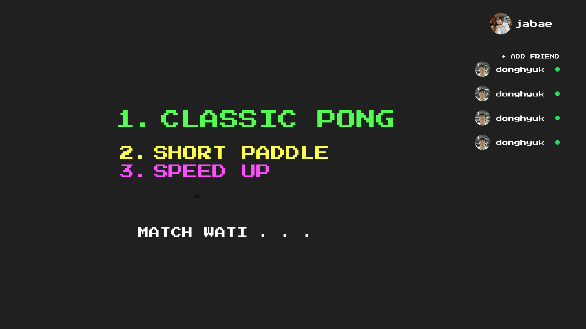

# 매치 페이지

<figure><figcaption><p>매치 페이지</p></figcaption></figure>

> SOCKET API

### 매치 등록

```javascript
socket.emit('submitMatch', {
    gametype: classic | paddle | speed
}, (res) => {});
```

<details>

<summary>매치 등록</summary>

* 매치등록시 사용하는 소켓
* 매치 페이지에서 게임 모드를 선택하여 선택된 게임 타입을 보낸다
* 콜백함수를 받아 정상적으로 등록이 되었는지 판별한다

</details>

### 매치 취소

```jsx
socket.emit('cancelMatch', (res) => {});
```

<details>

<summary>매치 취소</summary>

* 선택된 매치를 취소한다
* 콜백함수를 받아 정상적으로 등록이 되었는지 판별한다

</details>

### 매치 알림

```jsx
socket.on('waitMatch', ());
```

<details>

<summary>매치 알림</summary>

* 매치를 잡히면 알려주는 소켓
* 화면에 매치 참여 여부 모달을 띄움

</details>

### 매치 수락

```javascript
socket.emit('enterMatch', { 
    status: true | false ,
})
```

<details>

<summary>매치 수락</summary>

* 매치 참여 여부를 전달하는 소켓

</details>

### 매치 성사

```javascript
socket.on('successMatch', {
	status: true | false ,
})
```

<details>

<summary>매치 성사</summary>

* 매치 성사를 기다리는 소켓
* match enter 에서 true 를 누름 사람만 받음
* 이미 true 누른 사람은 대기
* 성사된다면 게임 페이지로 이동

</details>
